# Passo a passo para criar Banco de Dados no Amazon RDS

### Passo 1:
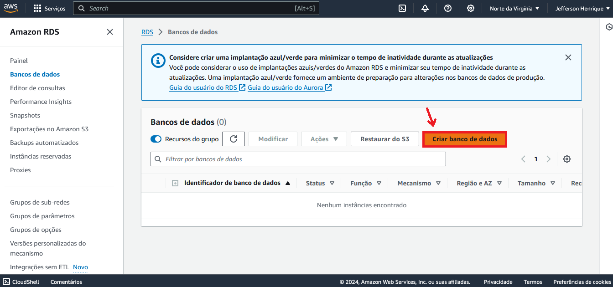

### Passo 2:
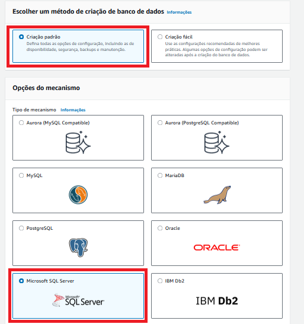

### Passo 3:
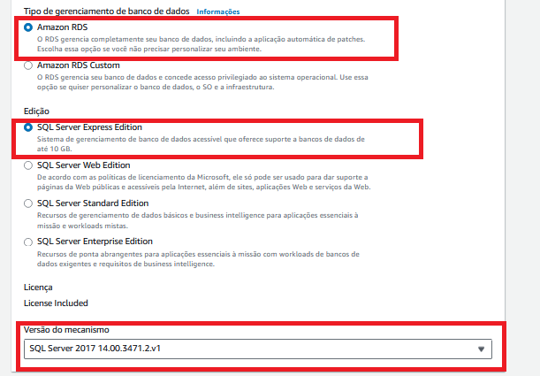

### Passo 4:
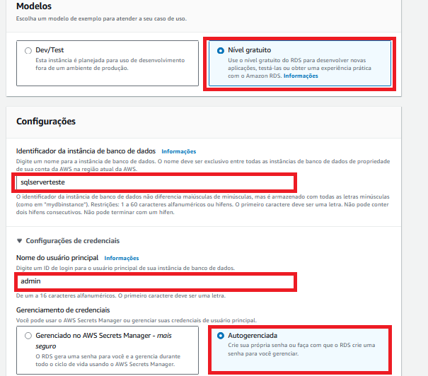

### Passo 5:

### Passo 6:

### Passo 7:
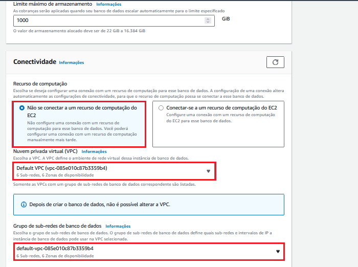

### Passo 8:
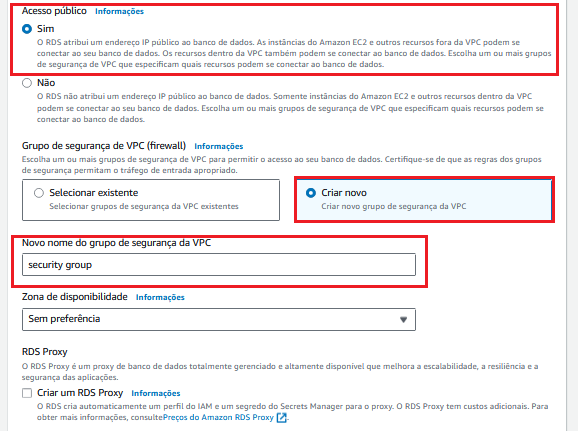

### Passo 9:
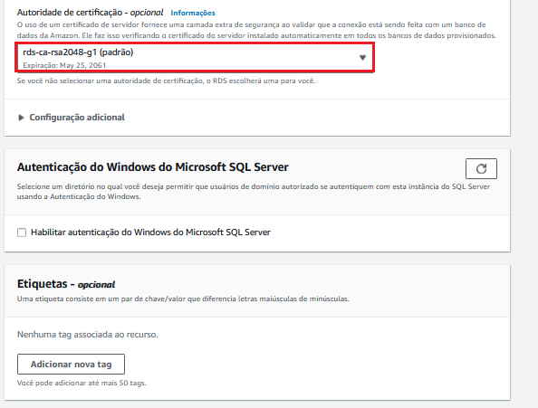

### Passo 10:
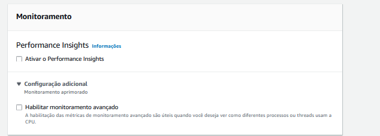

### Passo 11:
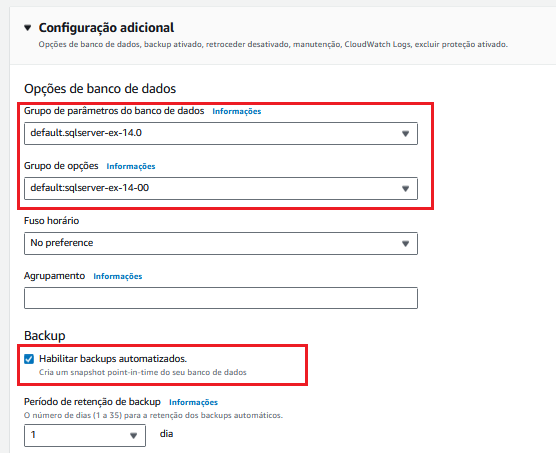

### Passo 12:
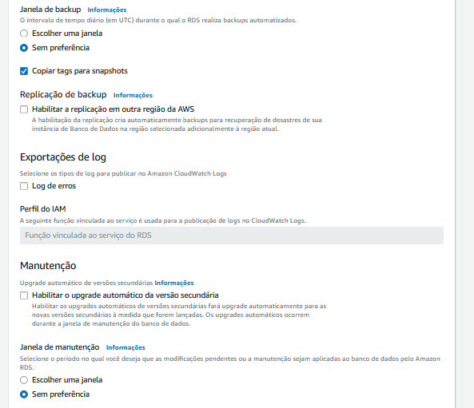

### Passo 13:
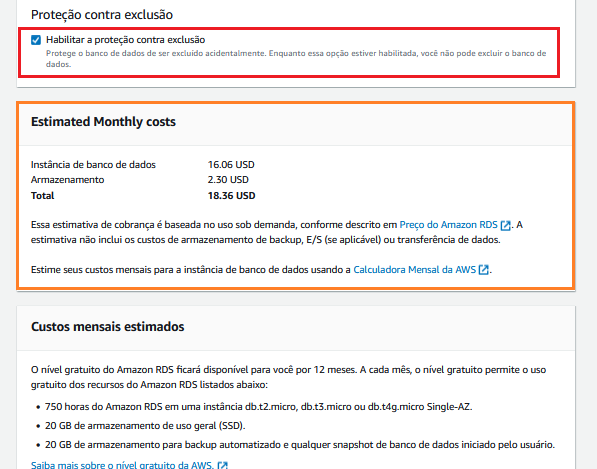

### Passo 14:
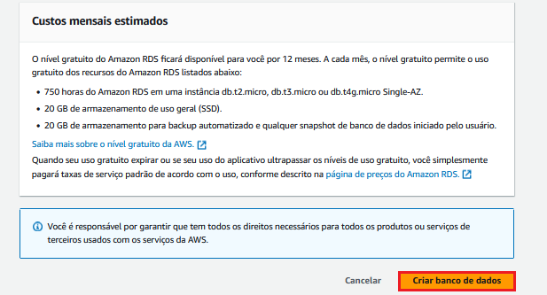

### Passo 15:
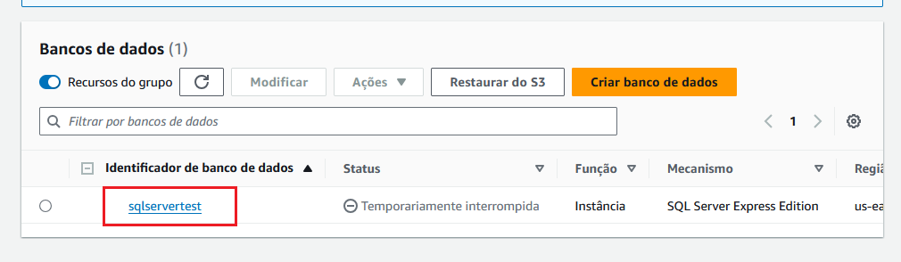

### Passo 16:
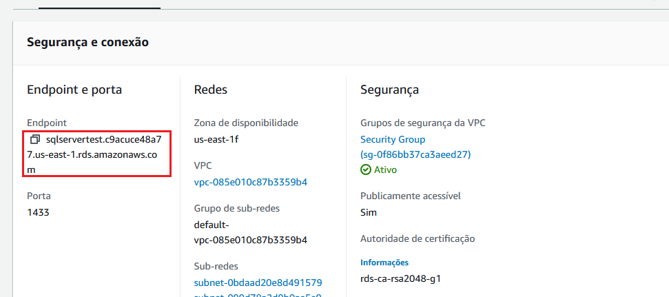

### Passo 17: Conectando ao Banco com o SSMS
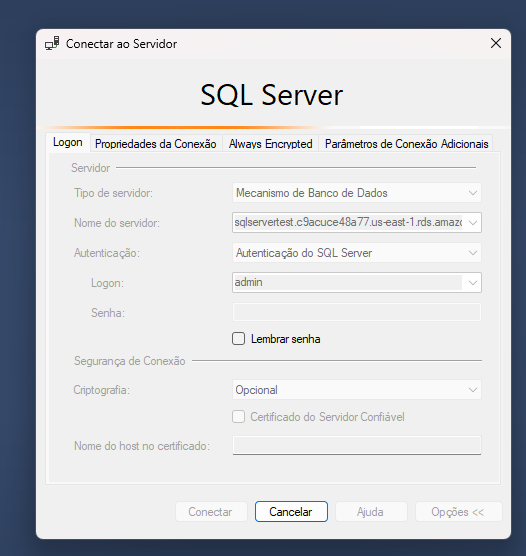

### Passo 18:
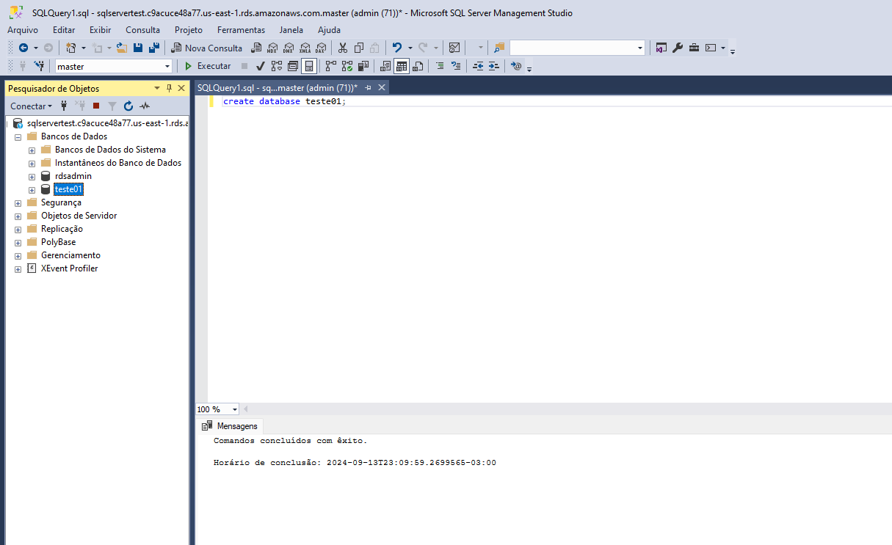
