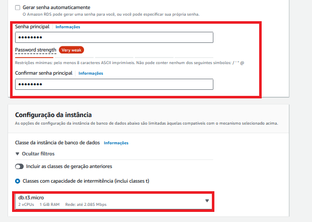

# Passo a passo para criar Banco de Dados no Amazon RDS

### Passo 1: Criando Banco de dados

### Passo 2: Escolhendo Mecanismo

### Passo 3: Tipo de Gerenciamento e Edição do SQL
#### As seleções foram de acordo com o plano gratuito.

### Passo 4: Nome do Banco, User e Senha
#### Selecionei a senha autogerenciada para colocar uma senha de preferencia e facilitar o tutorial, porém pode escolher a outra opção sem problemas.

### Passo 5:

### Passo 6: Tipo de armazenamento
#### Se tem preocupação com a taxa de serviço, recomendo colocar o tamanho minimo e habilitar a opção de escabilidade

### Passo 7: Conectividade
#### Coloquei VPC padrão, mas pode criar uma nova 

### Passo 8: Acessibilidade
#### Importante habilitar o acesso público para acessar seu banco em diversas ferramentas
#### Criei um Grupo de Segurança para não utilizar um grupo existente em outra ferramenta da Aws

### Passo 9:

### Passo 10:

### Passo 11: Opções de banco

### Passo 12: Backup

### Passo 13: Proteção / Custos
#### Importante habilitar a proteção contra exclusão
#### Em seguida, uma estimativa de custos

### Passo 14:

### Passo 15:

### Passo 16:

### Passo 17: Conectando ao Banco com o SSMS

### Passo 18:

### Passo 19: Erro de conexão no SSMS
#### Deu erro ao conectar? verifique as regras de entrada e saída do Security Group
#### Utilize as fotos abaixo como referência:

