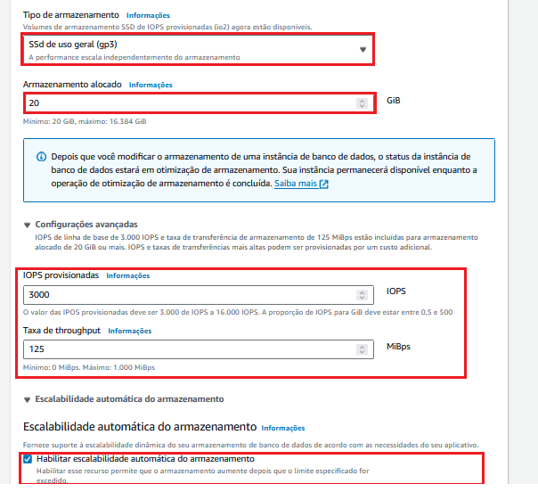

# Passo a passo para criar Banco de Dados no Amazon RDS

### Passo 1:

### Passo 2:

### Passo 3:

### Passo 4:

### Passo 5:

### Passo 6:

### Passo 7:

### Passo 8:

### Passo 9:

### Passo 10:

### Passo 11:

### Passo 12:

### Passo 13:

### Passo 14:

### Passo 15:

### Passo 16:

### Passo 17: Conectando ao Banco com o SSMS

### Passo 18:

